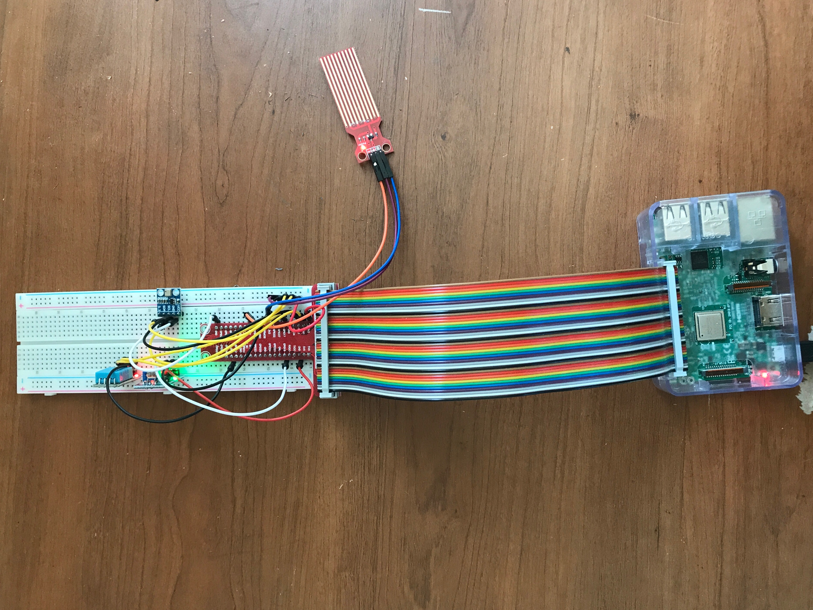
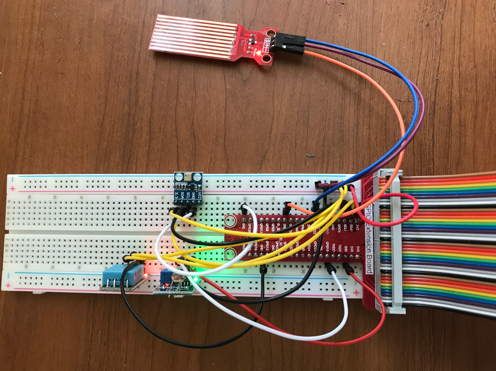

# **Embedded Linux Final Project**
I chose to create a weather system with my Raspberry Pi for my final project.
## **Equipment**
The materials and equipment I used to create this include:
* Raspberry Pi
* GPIO board
* GPIO board to Raspberry Pi cable connector
* DHT11 Temperature & Humidity Sensor Module
* BMP180 Digital Barometric Pressure Sensor Module
* Photosensitive Light Sensor Module
* Water Level Sensor Module
* Jumper wires
## **Wiring**
I used quite a lot of jumper wires for my project because I was using four sensors most of which have inputs, outputs, and grounds.
Each sensor required three wires (MBP180 requires four, but we'll get there) to get it connected. I'll go through each sensor step by step, and you can reference the image any time you'd like for extra assistance. First
thing to do however, since there are four sensors and only two 3v3 voltage outputs on the GPIO connector board, take a small red jumper wire, plug it into the 3v3 outlet, and then connect the other end to the first output spot in the red plus (+) row. 
We will connect each sensor to this red plus row to give them 3v3 voltage power.
1. **Water Level Sensor Module**
I used the jumper wires that have pins on and connectors on the other end. Since this is a water sensor that will be detecting rain, this will make it easier to stick the
sensor out of the window without ruining your weather system
	1. Take a jumper wire (one specified above) connect it to the '-' plug and pin it into a ground 'GND'
	1. With another jumper wire connect it to the '+' plug on the sensor and pin it in the red plus row on the board.
	1. The last wire gets connected to the 'S' plug and gets pinned into 'GPIO22' which is pin number 22 when coding the weather system.
1. **MBP180 Digital Barometric Pressure Sensor Module**
For the remaining three sensors I used the regular jumper wires that have pins on both sides of the wire. I also just plugged these sensor modules into the GPIO
board itself.
	1. Plug the sensor into the GPIO board
	1. With a jumper wire, plug the pin into the spot infront of the sensor labeled '3.3' and plug the other end into the red plus row on the board
	1. Plug another wire infront of the sensor labeled 'SDA' and put the other end into the GPIO connecter slot labeled 'SDA1'
	1. Another wire goes infornt of 'SCL' and into 'SCL1' on the connector
	1. The last wire for this sensor goes into 'GND' and likewise into a 'GND' slot on the connector.
	1. Connecting wires into the spot labeled 'VCC' wont be necessary so don't worry about that.
1. **DHT11 Temperature & Humidity Sensor Module**
	1. Plug the sensor into the GPIO board
	1. Use a jumper wire and plug one end of the pin into the spot infront of the sensor that is labeled 'VCC' and plug the other end into into a spot in the red plus row on the GPIO board
	1. Another jumper wire is used to connect the spot on the sensor labeled 'DATA' to 'GPIO17' which is GPIO pin number 17 to be used later in the code
	1. The last jumper wire connects the sensor output labeled 'GND' to a 'GND' spot on the GPIO connector
1. **Photosensitive Light Sensor Module**
	1. Plug the light sensor into the GPIO board
	1. This sensor has four outputs like the MPB180 sensor, only use the three labeled 'VCC', 'GND', and 'DO'
	1. Using a jumper wire pin 'VCC' on the sensor to a spot in the red plus row on the GPIO board
	1. Another wire is used to connect 'GND' to a 'GND' spot on the connector
	1. Lastly connect 'DO' to 'GPIO18' on the connector. This will be the light sensors pin number, 18.

Now that you've completed the wiring of the weather system, it's time to move onto the code of the project
## **Coding**
I used four different files while creating my weather system. Three of which are in a directory in my Raspberry Pi titled 'finalproject'.
These files included:
* weather.py
* weather.db
* flaskServer.py  

The other file was placed one directory ahead of 'finalproject' in a directory named 'templates'.
This file was:
* index.html  

Now lets get into the files and what theyre used for.
1. **weather.db**
This is the file that I used to store the data that the weather system was going to record. Using SQLite3, I was able to create a database file with many catagories.
Those categories being:
Date | Temperature | Humidity | Pressure | Sea Level Pressure | Altitude | Day Or Night | Rain or Shine
Having this is important if you want to notice changes that happen in the weather over time that your system will be recording. It's also important to have for your web app that
will display all of this data.
1. **weather.py**
This file contains a python script that tells the weather system to start recording and logging data with the sensors wired on the board. This file imports GPIO, and AdaFruit to 
record data such as temperature, humidity, day or night, if its raining, and so on. This script records weather data every five minutes and plugs it into the weather.db file
described above.
1. **flaskServer.py**
The flaskServer.py file also contains a python script. This is the file that we run when we want to see our data on a web app that will created through the index.html file.
flaskServer.py imports flask, json, and sqlite3 for it to work its magic. This file is the file that does most of the communication between the other scripts that allows us to
display our data. Using sqlite3 and json, this file grabs the data recorded from the weather.db database file and pushes it into multiple arrays that are later used in the index.html
file to chart, graph, and display our data. flaskServer.py uses flask to create 'App Routes' that communicate with both index.html and the internet server to create our web app.
1. **index.html**
This file, as stated previously is placed in a directory one ahead of 'finalproject' called 'templates'. This file is the bread and butter of our web app. Using HTML and JavaScript
code, we use this file to chart and display our data using google charts. The HTML code that surrounds the JavaScript code creates the layout of our web app, creating divisions
and headers thoughout the page that make our data looked organized. The JavaScript code is used to recieve data from weather.db retrieved by flaskServer.py, and draw google charts
and gauges that display this information. This file also contains images to be displayed depending on current conditions, and includes a prediction about upcoming weather conditions
based on high or low air pressure.
